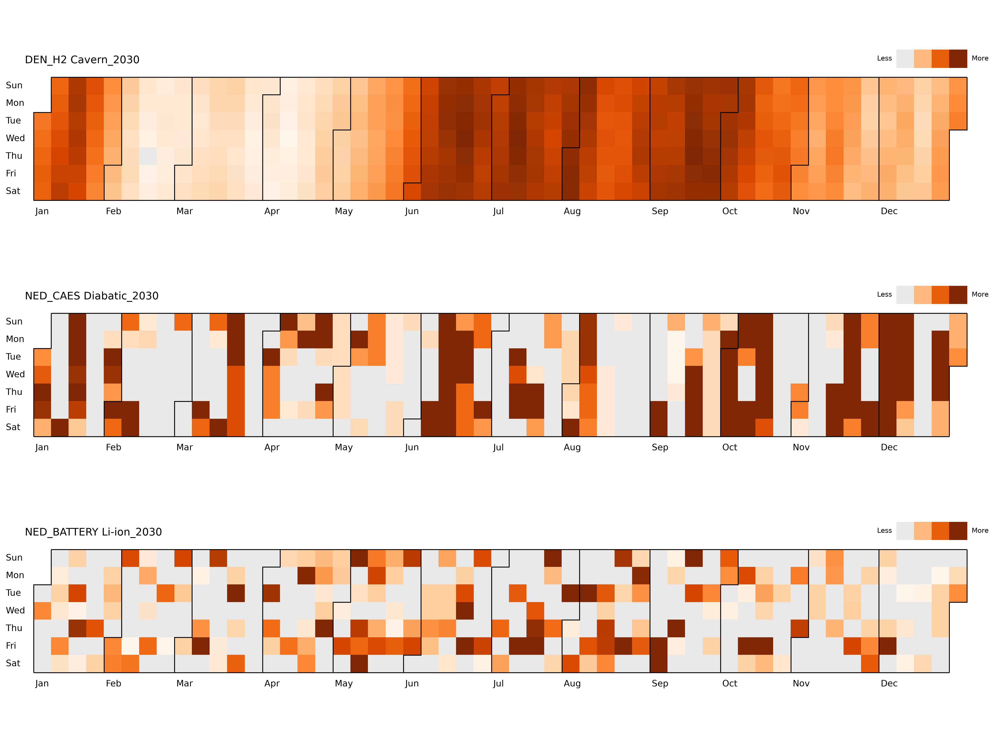

# Energy Storage Seasonality Visualisation

Vizualization project to identify the seasonality of an energy storage asset.



## Python environment with uv

This repository uses `uv` with `pyproject.toml` and `uv.lock` to keep the Python environment reproducible.

Install or sync the local environment from the lock file:

```powershell
uv sync
```

Run a workflow inside the environment:

```powershell
uv run python energy-storage-seasonality-plots.py
```

Useful `uv` commands:

```powershell
# Add a package and update uv.lock
uv add package-name

# Add a package with an exact version
uv add package-name==1.2.3

# Add exact bounds automatically
uv add --bounds exact package-name

# Remove a package and update uv.lock
uv remove package-name

# Update every package allowed by pyproject.toml
uv lock --upgrade

# Update one package
uv lock --upgrade-package package-name

# Check that uv.lock matches pyproject.toml
uv lock --check
```
